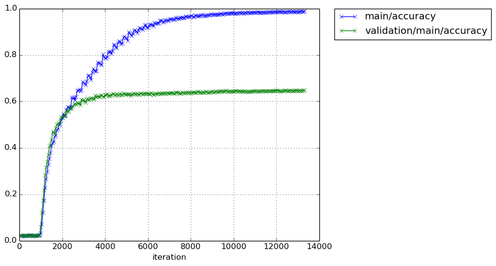
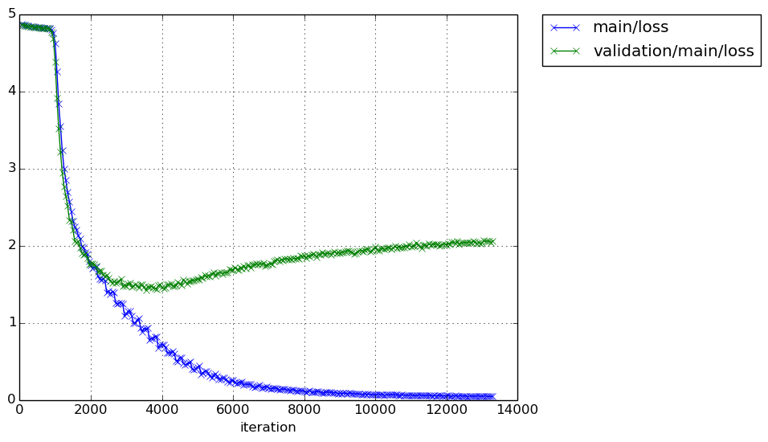
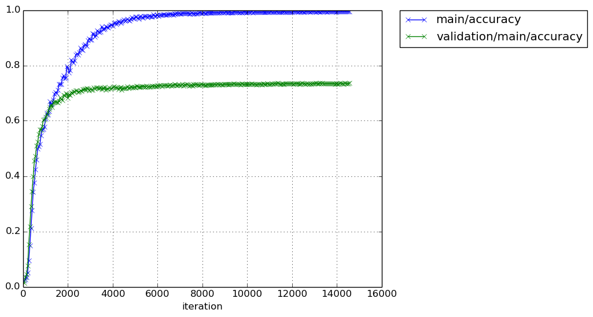
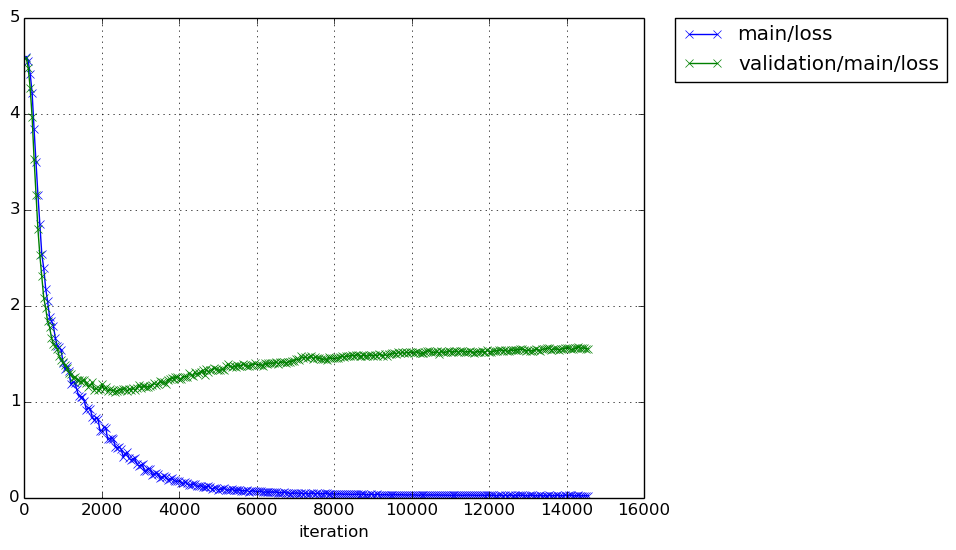

# chainer\_devise
implementation of DeViSE in Chainer

# 画像の収集
util/myrunを使って、500クラス、各クラス1000枚として収集。必ずしも1000枚とは限らない。詳細はhistogram.pngを参照のこと。
`
/Volumes/TOSHIBA EXT/mac/image_net/images/histogram.png
`
残念ながら、これ以上画像を増やすことができません。
`collectImagenet_selected.py`で試しましたが、だめでした。

# 画像ファイルか否か
画像ファイルか否かを`check_images.py`で確認する。画像でなければ削除、RGBでなければRGBに変換しjpg拡張子で保存する。
正常な画像なら拡張子はそのまま。

# 画像のリサイズ
`resize_images.py`を使って、画像サイズを変更する。
`run_resize_images`を使えば良い。

# 画像の反転
`increase_images.py`を使って、画像を反転する。100枚以下のディレクトリに適用する。

# 画像リストの作成
`create_list.py`を使って、画像名とラベルの対応付けを行う。
`run_create_list`を使えば良い。
各ディレクトリの中にlist.txtが出力される。

# 訓練・検証・テストデータの作成
`create_dataset.py`を使って、画像名とラベルの対応付けを行う。
`run_create_dataset`を使えば良い。
各ディレクトリの中にdataset\_list.txtが出力される。
train : test : valid = 6 : 3 : 1とした。
実際の訓練時には、train + valid : test = 7 : 3とする。

# dataset\_list.txtの作成
`create_total_list.py`を使い`dataset_list.txt`を1つにまとめる。total\_list.txtが出来上がる。
`run_create_total_list`を使う。

# test.txtとtrain\_valid.txtの作成
total\_list.txtにgrepを適用して、test.txtとtrain\_valid.txtを作る。
test\_.txt, train\_valid\_.txtはtestやtainなどの文字列を取り除いたものである。
```
cat total_list.txt | grep -e " train" -e " valid" > train_valid.txt
cat total_list.txt | grep " test" > test.txt
cut -d " " -f1,2 test.txt  > test_.txt
cut -d " " -f1,2 train_valid.txt  > train_valid_.txt
```

# 画像のくり抜きと平均画像からの差分
- 256x256の画像の中心部分を227x227のサイズにくり抜く。
- 差分画像もくり抜き、差分を取る。
- 結果を保存する。
以上の作業をdata\_preprocessor.pyで行う。
容量が大きくなり過ぎるので、保存するのは止めます。

# Iteratorの実装
- 256x256の画像の中心部分を227x227のサイズにくり抜く。
- 差分画像もくり抜き、差分を取る。
- batch size分の画像とラベルを返す。

chainer.dataset.DatasetMixinを使う。
既存のdata\_preprocessor.pyを書き換えた。

# caffe modelの変換
`visual/load_caffemodel.py`を使って、caffemodelをchainerのモデルに変換する。

# 訓練
`run_train.py`を実行する。出力ディレクトリに以下のファイルが出力される。
- log: 訓練履歴
- cg.dot: このファイルからグラフ構造を視覚化できる。
- model\_iter\_xxx: モデルのスナップショット
- snapshot\_iter\_xxx: trainerのスナップショット。これを使って訓練を再開できる。

注意点：訓練の再開に必要なものはsnapshot\_iter\_xxxだけである。
つまり、modelの構築は必要ない(たぶん)。予測するときにmodelは必要である。

# 学習結果-1
学習結果は以下の場所に保存してある。<br>
EC2では
```
/home/ubuntu/results/devise
```
localでは<br>
```
/Users/kumada/Documents/device
```
である。ディレクトリ名は、そこに納められた結果を導出する際に使用したコードのtag名と一致している。
クローリングした全画像を使用した。学習曲線は以下のとおり。<br><br>
20170414-09-19


20170418-07-14


いろいろ試行錯誤したが上記が限界である。テスト画像に対する正解率は0.6を辛うじて越す程度である。

# 学習結果-2
精度を上げるため、画像が200枚以下のディレクトリを捨てることにする。現在selected\_images\_256に納められている画像は反転画像を含む。
この各ディレクトリ内の画像枚数が200枚以下のものを捨てることにする。
現在の画像枚数を以下のファイルに記入した(`check_images.py`を使用した)。
```
/Users/kumada/Data/image_net/selected_images_256_num_images
```
このファイルを見て捨てるべきクラスを判定する。`run_select_classes`を使用した。
削除後のクラス数は130となる。出力先は
```
/Users/kumada/Data/image_net/selected_images_256_greater_than_200_images
```
である。学習結果は以下のとおり。<br><br>
20170427-07-21


ほんの少しだけ良くなったけが、もう少し上げたい。正解率の高いクラスだけを残すことにする。

# クラスの取捨選択
- `run_predict`で各クラスの正解率を見る。
- 結果をaccuracies\_for\_all\_classes.txtという名前で保存。
```
/Volumes/TOSHIBA EXT/mac/image_net/accuracies_for_all_classes.txt
```
正解率の下限を設定してクラスを選択する。そのときの平均正解率は以下のとおり。

|lower accuracy|average accuracy|count|
|:-----------|------------:|:------------:|
|0.5|0.69405|99|
|0.6|0.74951|73|
|0.7|0.80108|47|

- 残すべきクラスを抜き出す。結果をファイルに落とす。ファイルの保存場所はここ。lower accuracy=0.5とした。
```
/Volumes/TOSHIBA\ EXT/mac/image_net/selected_classes_by_accuracies.txt
```

- 「dataset\_list.txtの作成」を利用して、抜き出したクラスだけでtest.txt/train.txtを作る。
`run_create_total_list_by_accuracy`を実行すれば良い。結果のファイルは
```
/Volumes/TOSHIBA EXT/mac/image_net/selected_images_256_greater_than_200_images/total_list_selected.txt
```
である。このファイルを使ってtest\_selected\_.txt / train\_valid\_selected\_.txtを作る。
```
cat total_list_selected.txt | grep -e " train" -e " valid" > train_valid_selected.txt
cat total_list_selected.txt | grep " test" > test_selected.txt
cut -d " " -f1,2 test_selected.txt  > test_selected_.txt
cut -d " " -f1,2 train_valid_selected.txt  > train_valid_selected_.txt
```
- 最後にlabel\_selected.txtを作る。selected\_classes\_by\_accuracies.txtをベースにして作る。
`make_label_selected.py`を実行する。

# 学習結果-3
20170517-07-20


正解率は0.735となった。しかし、過学習気味。まあいいや。先に進む。

# enwikiの加工
## ruby関係のインストール。
```
$> sudo port install rbenv ruby-build
$> rbenv install --list
$> rbenv install 2.3.1
$> rbenv local 2.3.1
$> rbenv global 2.3.1
$> rbenv exec gem install nokogiri -- --use-system-libraries 
$> rbenv exec gem install wp2txt bundler
$> rbenv rehash
```

## 変換
```
$> rbenv exec wp2txt --input-file enwiki-20101011-pages-articles.xml.bz2
```
途中で、こんなエラーが出る。
```
stack level too deep (SystemStackError)
```
[ここ](http://medialab.di.unipi.it/wiki/Wikipedia_Extractor)にあるWikiExtractor.pyを使う。
```
$> ./WikiExtractor.py --processes 3 -cb 10M -o extracted enwiki-20101011-pages-articles.xml.bz2
```
3つのプロセスが起動する。--processesに指定するプロセス数のデフォルトは7、このまま実行するとファンがフル回転します。10M単位でテキストファイルに変換し、そのあと圧縮します。途中で止まりました。

[ここ](https://markroxor.github.io/gensim/static/notebooks/online_w2v_tutorial.html)を参考にします。
20101011のwikidumpに適用すると以下のエラーが出ます。

```
AttributeError: 'NoneType' object has no attribute 'text'
```
最近のwikidumpに適用してみます。
できましたが、８日ほどかかりました。
そのあと、gensim.models.word2vec.LineSentenceのオブジェクトを作る。
一回呼び出すと、一文を単語のリストにして返してくれる。

# deviseの構築

- extraxt embed.W(A) from word2vec.
- normalize A to be unit vector.
- extract an output(B) of fc7 from CNN.
- apply a matrix(M) to B to have the shape of B be the same as that of A.
- use a combination of dot-product similarity and hinge rank loss.
- train M while holding A and B fixed.
- fine-tune CNN.

`run_train_devise_in_first_stage.py`を実行したあと`run_train_devise_in_second_stage.py`を実行する。

## 入力ファイルのフォーマット
train\_valid\_selected\_.txtと同じ。
ただし、画像は特徴ベクトルに、ラベルは対応するword vectorに変換する。<br>
例：
palace/21\_1150541246\_85fdc255cb.jpg 61<br>
palace/21\_1150541246\_85fdc255cb.jpgを特徴ベクトルに変換、61はpalaceに置き換え、これをword vectorに変換する。<br>

これらの変換は既存のクラスDataPreprocessorを拡張したクラスDataPreprocessorForDevise内で行う。
このクラス内で`feature_extractor.py`と`word2vec_converter.py`を使う。

