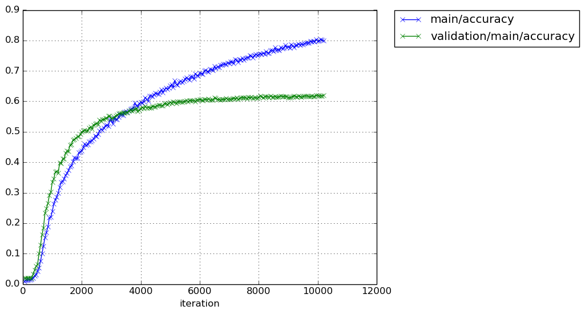

# chainer_devise
implementation of DeViSE in Chainer

# 画像の収集
util/myrunを使って、500クラス、各クラス1000枚として収集。必ずしも1000枚とは限らない。詳細はhistogram.pngを参照のこと。
`
/Volumes/TOSHIBA EXT/mac/image_net/images/histogram.png
`
残念ながら、これ以上画像を増やすことができません。
`collectImagenet_selected.py`で試しましたが、だめでした。

# 画像ファイルか否か
画像ファイルか否かを`check_images.py`で確認する。画像でなければ削除、RGBでなければRGBに変換しjpg拡張子で保存する。
正常な画像なら拡張子はそのまま。

# 画像のリサイズ
`resize_images.py`を使って、画像サイズを変更する。
`run_resize_images`を使えば良い。

# 画像の反転
`increase_images.py`を使って、画像を反転する。100枚以下のディレクトリに適用する。

# 画像リストの作成
`create_list.py`を使って、画像名とラベルの対応付けを行う。
`run_create_list`を使えば良い。
各ディレクトリの中にlist.txtが出力される。

# 訓練・検証・テストデータの作成
`create_dataset.py`を使って、画像名とラベルの対応付けを行う。
`run_create_dataset`を使えば良い。
各ディレクトリの中にdataset_list.txtが出力される。
train : test : valid = 6 : 3 : 1とした。
実際の訓練時には、train + valid : test = 7 : 3とする。

# dataset_list.txtの作成
`create_total_list.py`を使い`dataset_list.txt`を1つにまとめる。total_list.txtが出来上がる。
`run_create_total_list`を使う。

# test.txtとtrain_valid.txtの作成
total_list.txtにgrepを適用して、test.txtとtrain_valid.txtを作る。
test_.txt, train_valid_.txtはtestやtainなどの文字列を取り除きたものである。

# 画像のくり抜きと平均画像からの差分
- 256x256の画像の中心部分を227x227のサイズにくり抜く。
- 差分画像もくり抜き、差分を取る。
- 結果を保存する。
以上の作業をdata_preprocessor.pyで行う。
容量が大きくなり過ぎるので、保存するのは止めます。

# Iteratorの実装
- 256x256の画像の中心部分を227x227のサイズにくり抜く。
- 差分画像もくり抜き、差分を取る。
- batch size分の画像とラベルを返す。

chainer.dataset.DatasetMixinを使う。
既存のdata_preprocessor.pyを書き換えた。

# caffe modelの変換
`visual/load_caffemodel.py`を使って、caffemodelをchainerのモデルに変換する。

# 訓練
`run_train.py`を実行する。出力ディレクトリに以下のファイルが出力される。
- log: 訓練履歴
- cg.dot: このファイルからグラフ構造を視覚化できる。
- model_iter_xxx: モデルのスナップショット
- snapshot_iter_xxx: trainerのスナップショット。これを使って訓練を再開できる。

注意点：訓練の再開に必要なものはsnapshot_iter_xxxだけである。
つまり、modelの構築は必要ない(たぶん)。予測するときにmodelは必要である。

# 学習結果-1
学習結果は以下の場所に保存してある。<br>
EC2では
```
/home/ubuntu/results/devise
```
localでは<br>
```
/Users/kumada/Documents/device
```
である。ディレクトリ名は、そこに納められた結果を導出する際に使用したコードのtag名と一致している。
クローリングした全画像を使用した。学習曲線は以下のとおり。<br><br>
20170414-09-19


20170418-07-14


いろいろ試行錯誤したが上記が限界である。テスト画像に対する正解率は0.6を辛うじて越す程度である。
精度を上げるため、200枚以下のディレクトリを捨てることにする。現在selected_images_256に納められている画像は反転画像を含む。
この各ディレクトリ内の画像枚数が200枚以下のものを捨てることにする。
現在の画像枚数を以下のファイルに記入した(`check_images.py`を使用した)。
```
/Users/kumada/Data/image_net/selected_images_256_num_images
```
このファイルを見て捨てるべきクラスを判定する。判定処理は`run_select_classes`である。


# enwikiの加工
## ruby関係のインストール。
```
$> sudo port install rbenv ruby-build
$> rbenv install --list
$> rbenv install 2.3.1
$> rbenv local 2.3.1
$> rbenv global 2.3.1
$> rbenv exec gem install nokogiri -- --use-system-libraries 
$> rbenv exec gem install wp2txt bundler
$> rbenv rehash
```

## 変換
```
$> rbenv exec wp2txt --input-file enwiki-20101011-pages-articles.xml.bz2
```
途中で、こんなエラーが出る。
```
stack level too deep (SystemStackError)
```
[ここ](http://medialab.di.unipi.it/wiki/Wikipedia_Extractor)にあるWikiExtractor.pyを使う。
```
$> ./WikiExtractor.py --processes 3 -cb 10M -o extracted enwiki-20101011-pages-articles.xml.bz2
```
3つのプロセスが起動する。--processesに指定するプロセス数のデフォルトは7、このまま実行するとファンがフル回転します。10M単位でテキストファイルに変換し、そのあと圧縮します。途中で止まりました。

[ここ](https://markroxor.github.io/gensim/static/notebooks/online_w2v_tutorial.html)を参考にします。
20101011のwikidumpに適用すると以下のエラーが出ます。

```
AttributeError: 'NoneType' object has no attribute 'text'
```
最近のwikidumpに適用してみます。
できましたが、８日ほどかかりました。
そのあと、gensim.models.word2vec.LineSentenceのオブジェクトを作る。
一回呼び出すと、一文を単語のリストにして返してくれる。


